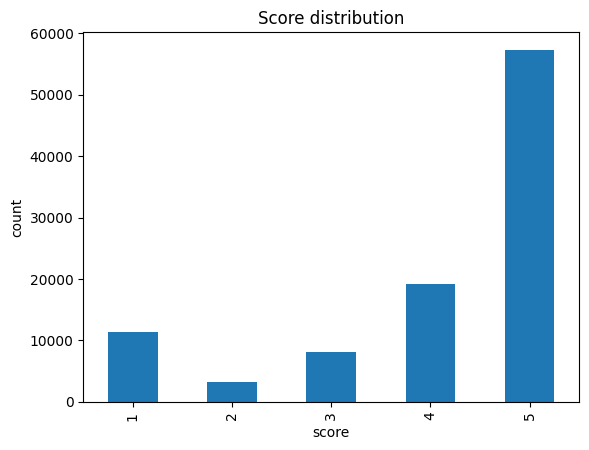
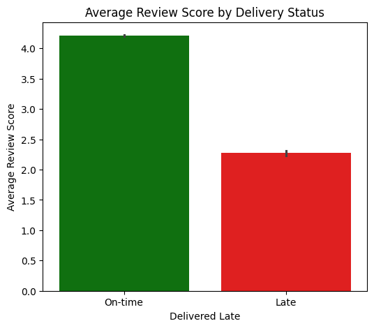
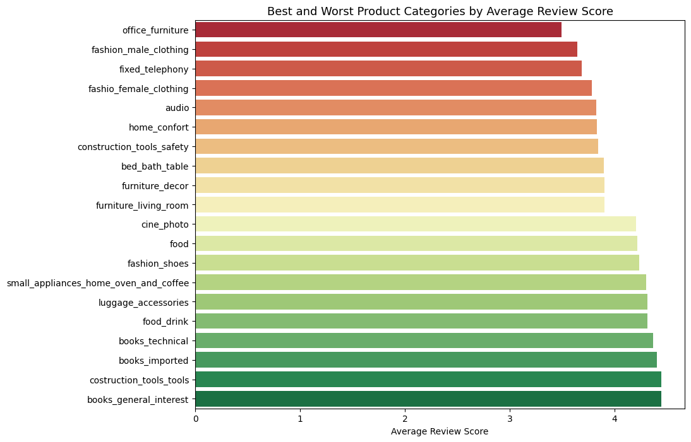
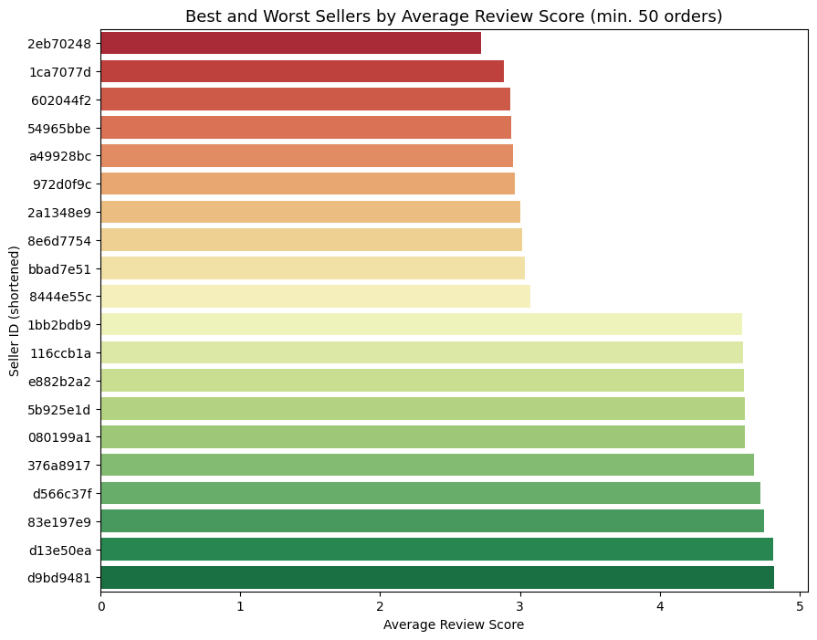

[README.md](https://github.com/user-attachments/files/31338976/README.md)
# Analyzing Customer Satisfaction — Olist Brazilian E-Commerce

Identifying what drives low customer review scores on a real-world e-commerce marketplace, using exploratory data analysis and hypothesis testing on 110,000+ orders.

## Overview

Olist is a Brazilian e-commerce marketplace connecting small businesses to major retail channels. This project investigates what factors are most strongly associated with low customer review scores (1-star ratings), testing four hypotheses: **delivery delay, order cancellation, product category, and seller performance.**

**TL;DR:** Delivery delay and seller performance are the strongest drivers of dissatisfaction — not what's being sold, but how reliably it gets delivered and who is selling it.

## Business Problem

> What factors are most strongly associated with low customer review scores, and which should Olist prioritize addressing first?

Understanding this helps prioritize where the platform should invest — customer support, seller policies, or logistics — to reduce negative reviews and protect long-term customer retention.

## Dataset

[Olist Brazilian E-Commerce Public Dataset](https://www.kaggle.com/datasets/olistbr/brazilian-ecommerce) (Kaggle) — 9 relational tables covering orders, customers, order items, products, sellers, payments, and reviews (2016–2018).

## Tools

Python · Pandas · Seaborn · Matplotlib · Jupyter/Colab

## Key Findings

### Review scores are polarized
Most customers are highly satisfied, but a meaningful share (11.5%) leave 1-star reviews — a bimodal pattern that signals distinct, identifiable problems rather than generic mild dissatisfaction.



### Delivery delay is the strongest single driver
Only 6.46% of orders arrived late, but this group's average score dropped from 4.21 to 2.27 — and late deliveries alone account for **30% of all 1-star reviews**.



### Product category has only a weak effect
After filtering out categories with fewer than 50 orders (to avoid unreliable small-sample averages), scores ranged narrowly from 3.49 (`office_furniture`) to 4.64 (`cds_dvds_musicals`) — too small a spread to be a major driver on its own.



### Seller performance is a strong, underexplored driver
Among 460 reliable sellers (50+ orders, covering 77% of total order volume), the worst performer averaged just **2.72** — a stronger negative signal than any product category.



*(Order cancellations were also tested — while rare, 69.3% of canceled orders received a 1-star review, showing the cancellation experience itself is strongly tied to dissatisfaction. See the [full report](FINAL_REPORT.md) for details.)*

## Recommendations

1. **Seller performance monitoring** — publicly display ratings for sellers with 50+ orders; label newer/lower-volume sellers as "Building Track Record" instead of showing an unreliable score
2. **Delivery delay management** — allow cancellation with automatic refund for severe delays; send proactive delay notifications with compensation
3. **Deprioritize product category fixes** — focus resources on delivery and seller quality first, then revisit category-level differences
4. **Improve the cancellation experience** — immediate automatic refunds and empathetic communication, since cancellations (regardless of cause) are strongly tied to 1-star reviews

Full reasoning and data basis for each recommendation is in the [final report](FINAL_REPORT.md).

## Project Structure

```
├── notebooks/
│   └── 01_Olist.ipynb          # Full analysis: cleaning, EDA, feature engineering, visualization
├── images/                      # Exported chart images used in this README
├── FINAL_REPORT.md              # Full write-up: methodology, findings, recommendations, limitations
└── README.md
```

## How to Run

1. Download the dataset from [Kaggle](https://www.kaggle.com/datasets/olistbr/brazilian-ecommerce) and place the CSVs in a `data/` folder
2. Open `notebooks/01_Olist.ipynb` in Jupyter or Google Colab
3. Run all cells (requires `pandas`, `matplotlib`, `seaborn`)

## Limitations

This analysis is correlational, not causal — it identifies strong associations, not proven cause-and-effect relationships. Seller- and category-level findings exclude low-volume entities to ensure statistical reliability. See the [full report](FINAL_REPORT.md) for a complete discussion of limitations and next steps.

## Author

Hannah Peyambari
